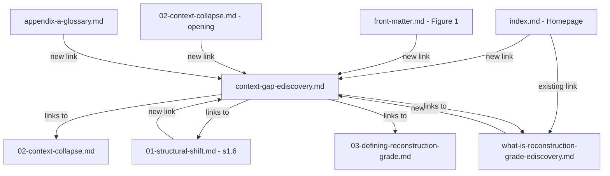

# Plan: Context Gap Definition Page & Cross-Linking Strategy

## Objective

Create a standalone **Context Gap in eDiscovery** definition page optimized for AI/LLM discoverability and SEO, then cross-link it throughout the standard to reinforce topical authority.

## Rationale

AI systems and search engines strongly prefer pages that **explicitly define a term at the top level**. The Context Gap concept already exists throughout the standard but is buried as a subsection in other pages. Promoting it to a standalone, independently-addressable page is the single highest-impact move for AI/SEO discoverability.

---

## Architecture



---

## Step 1 — Create `standard/context-gap-ediscovery.md`

### File structure

```
---
title: The Context Gap in eDiscovery
description: Definition and explanation of the Context Gap — the structural difference between collaborative cloud evidence behavior and traditional eDiscovery exports.
keywords: context gap ediscovery, collaborative evidence, modern attachments, microsoft 365 ediscovery, version lineage, identity drift, reconstruction-grade
---

# The Context Gap in eDiscovery

> **Context Gap (eDiscovery):**
> The structural difference between collaborative cloud evidence behavior
> and the final-state file exports typically produced by traditional
> eDiscovery systems.

## Definition
[Full definition — what it is, why it exists, what it means]

## How the Context Gap Manifests
[Concrete examples with the existing context-gap-diagram.png]

## Related Concepts
[Semantic concept graph for LLM consumption]

## How Reconstruction-Grade eDiscovery Addresses the Context Gap
[Links back into the standard]

## Further Reading
[Links to standard sections and blog posts]
```

### Key content principles

1. **Citeable definition box** — blockquote at the very top of the page body, before any section heading. AI models quote these.
2. **Standalone definition** — does NOT duplicate the "What Is RGR" page content. Focuses specifically on the *problem* (Context Gap), not the *solution* (RGR). The two pages form a problem/solution pair.
3. **Concept graph section** — explicit related-concept list with bold terms that match concepts defined elsewhere in the standard: Modern Attachments, Version Lineage Evidence, Identity Drift, Permission vs Observed Access, Reproducible Evidence Exports, Context Collapse.
4. **Reuse existing diagram** — `images/context-gap-diagram.png` (already used in front-matter.md) is the perfect visual for this page.
5. **YAML front matter** — `title`, `description`, `keywords` for search engines and MkDocs meta plugin.

---

## Step 2 — Add Nav Entry in `mkdocs.yml`

Insert as a peer to the existing "What Is" page:

```yaml
nav:
  - Home: index.md
  - "What Is Reconstruction-Grade eDiscovery?": what-is-reconstruction-grade-ediscovery.md
  - "What Is the Context Gap in eDiscovery?": context-gap-ediscovery.md    # ← NEW
  - "Toolkit (Non‑Normative)":
    ...
```

This creates two top-level definition pages that AI crawlers will discover independently — the exact pattern that maximizes discoverability.

---

## Step 3 — Add Link from Homepage

In `standard/index.md`, add a link to the new page alongside the existing "Why this exists" section. Two options:

**Option A** — Add to the Quick Links section:
```markdown
## Quick links (most used)
- [What is the Context Gap in eDiscovery?](context-gap-ediscovery.md)
```

**Option B** — Add inline link in the "Why this exists" heading area:
```markdown
## Why this exists: the Context Gap

... existing content ...

→ [Read the full definition: The Context Gap in eDiscovery](context-gap-ediscovery.md)
```

**Recommendation:** Do both. The Quick Links addition helps navigation; the inline link helps SEO with contextual anchor text.

---

## Step 4 — Cross-Link from Existing Pages

Six cross-link insertions, all lightweight and non-disruptive:

| File | Location | Change |
|------|----------|--------|
| `index.md` | Quick Links + §Why this exists | Add link |
| `what-is-reconstruction-grade-ediscovery.md` | `## The Context Gap` heading area | Add "See full definition" link |
| `front-matter.md` | Figure 1 caption | Add link on "Context Gap" text |
| `01-structural-shift.md` | §1.6 "context gap" reference | Link first mention |
| `02-context-collapse.md` | Opening paragraph "Context collapse" | Add parenthetical linking Context Gap |
| `appendix-a-glossary.md` | "Context gap" entry | Add hyperlink to definition page |

---

## Step 5 — Verify

- `mkdocs build --clean` exits 0
- All new and modified links resolve
- Page renders correctly in browser with proper heading hierarchy, blockquote styling, diagram, and concept graph

---

## Files Modified

| File | Action |
|------|--------|
| `standard/context-gap-ediscovery.md` | **CREATE** — standalone definition page |
| `mkdocs.yml` | **MODIFY** — add nav entry |
| `standard/index.md` | **MODIFY** — add link in Quick Links + Why this exists |
| `standard/what-is-reconstruction-grade-ediscovery.md` | **MODIFY** — add link to full definition |
| `standard/front-matter.md` | **MODIFY** — add link on Figure 1 caption |
| `standard/01-structural-shift.md` | **MODIFY** — link context gap in §1.6 |
| `standard/02-context-collapse.md` | **MODIFY** — add link in opening paragraph |
| `standard/appendix-a-glossary.md` | **MODIFY** — hyperlink glossary entry |

**No normative content is added or changed.** All modifications are non-normative (navigation, cross-links, and a new informational definition page).
