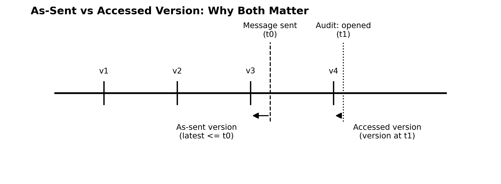

# 1. The Structural Shift in Evidence Behavior

The shift from on-premises file shares and email attachments to cloud-native collaboration has changed the evidentiary substrate. The change is not primarily about volume. It is about how work is performed, recorded, and referenced.

## 1.1 The Core Assumptions That No Longer Hold

Traditional eDiscovery workflows tend to embed four assumptions:

- Files are the unit of work and the unit of evidence.
- Ownership implies relevance; custodians are stable boundaries.
- Permissions imply access; access can be inferred.
- Versions are interchangeable; the latest version is "close enough."

Collaborative cloud environments violate these assumptions by design. Work occurs through hyperlinks instead of attachments, co-authoring instead of discrete drafts, shared repositories instead of personal storage, and continuous revision instead of immutable records.

Table 1. Legacy Assumptions vs Collaborative Reality

| Evidence Dimension | Legacy Assumption | Collaborative Reality |
| --- | --- | --- |
| Unit of work | File / attachment | Activity + link + shared repository object |
| Evidence capture | Final-state collection | Point-in-time resolution per event |
| Custodians | Static containers | Natural persons with effective-dated identity |
| Access | Inferred from permissions | Observed via audit evidence where available |
| Versioning | Minor or ignored | Continuous; non-linear growth; version lineage is evidentiary |
| Messages | Immutable email | Threaded, editable, multi-modal conversations |

## 1.2 Hyperlinks Replaced Attachments

In legacy email systems, the attachment and the message were inseparable: the bytes were embedded and fixed at send time. In Microsoft 365, messages frequently contain hyperlinks or modern attachments that reference repository objects. The message does not preserve the document behind the link.

Defensible reconstruction therefore depends on preserving both the communication event and the referenced object state. A preserved file without its event bindings cannot explain what it meant at the time it was used.

| Scenario: Hyperlinked decision memo A Teams message links to a OneDrive document used to approve a high-impact decision. The file is edited after the message is sent. A traditional export collects the current file bytes. The exported bytes are not the bytes that informed the decision at the time. Without deterministic point-in-time resolution, reconstruction becomes narrative-driven. |
| --- |

## 1.3 Version Lineage Is Now Evidentiary

Version history is not merely a storage feature. In collaborative systems, version lineage is the audit trail of authorship, evolution, and reliance.

Reconstruction-Grade eDiscovery requires that file versions be enumerated and preserved with stable identifiers, timestamps, and bytes. Point-in-time queries must be able to select a version at or before an event timestamp deterministically.

**Figure 2 — As-Sent vs Accessed Version Resolution**

## 1.4 Identity Drift and the Static Custodian Myth

Custodians are not directory objects frozen in time. People change roles, teams, reporting lines, access rights, and responsibilities. Legal questions are temporal. Discovery requests are drafted around historical periods, not present-day org charts.

Effective identification therefore requires effective-dated identity: a historical record of who a person was during the relevant period (department, role, manager, status, group membership), not merely who they are today.

## 1.5 Permissions Are Not Proof of Behavior

Permissions describe potential access. They do not prove actual interaction. Access is time-bound, revocable, and contextual. When discovery decisions rely on inferred access instead of observed behavior, evidence is replaced by assumption.

Reconstruction-Grade systems treat audit logs as first-class evidence inputs and correlate them to preserved objects and version timelines to answer: who saw what, when.

## 1.6 Context Decays Over Time

A defining characteristic of the [Context Gap](concepts/context-gap-ediscovery.md) is that context decays. People leave organizations, repositories are repurposed, links break, and audit logs age out. Traditional eDiscovery begins after this loss has occurred.

Reconstruction-Grade practice assumes that waiting is the mistake: if context will be required later, it must be preserved while it exists.
