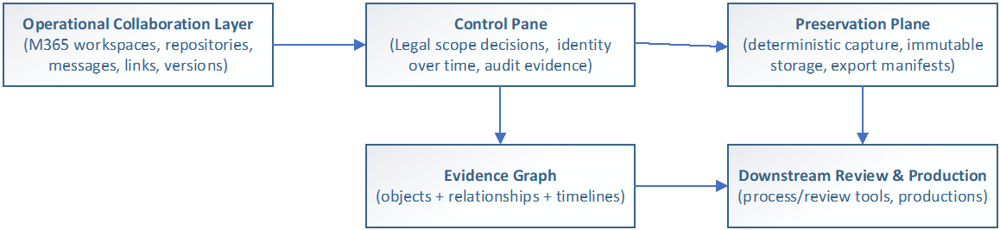

# 4. The Preservation System of Record

Modern collaboration platforms are operational systems. They are designed to enable work, not to serve as historical systems of record for litigation-grade reconstruction. Review platforms are downstream consumers. Archives are storage systems. Compliance tooling is policy-oriented.

Reconstruction-Grade eDiscovery requires an explicit Preservation System of Record: a layer that preserves context, determinism, and evidentiary traceability without flattening collaborative reality.

**Figure 4 — Reference Architecture: Preservation System of Record**

## 4.1 Responsibilities of a Preservation System of Record

- Maintain an evidence graph linking people, identities, events, artifacts, versions, and audit signals.
- Provide a decision ledger: immutable record of scope definitions, preservation triggers, queries, and exceptions.
- Perform deterministic capture of content and relationships for in-scope matters.
- Persist stable identifiers and lineage metadata sufficient for future re-resolution.
- Produce reproducible exports with manifests, hashes, and complete exception traceability.

## 4.2 What a Preservation System of Record Is Not

- It is not a downstream review platform (those systems assume the evidence has already been normalized).
- It is not simply a storage archive (storage without context does not reconstruct).
- It is not merely a compliance policy layer (policy does not preserve point-in-time relationships).
- It is not an analytics layer that infers missing context after the fact.

## 4.3 Evidence-Based Scoping

At enterprise scale, scoping is not a clerical step. It is a defensibility-critical decision. Reconstruction-Grade operating models treat identification and scope as evidence-based processes: identity over time, repository usage patterns, and audit-derived interaction signals are used to determine what must be preserved.

| Design Principle: Preserve one authoritative object; never collapse context A single file object may be referenced across many messages, channels, and actors. Deduplicating the bytes can be operationally correct. However, collapsing the events (who shared, where, when, which version) destroys context. Reconstruction-Grade systems preserve the object once while retaining all contextual bindings. |
| --- |

## 4.4 Immutability and Auditability

Reconstruction-Grade evidence must be immutable once preserved, and the system must maintain an audit trail sufficient to reproduce and defend: what was in scope, why it was in scope, what was collected, what failed, what was retried, and what was exported.

This includes not only content-level hashes but also workflow-level audit trails for scope decisions and exception handling.
