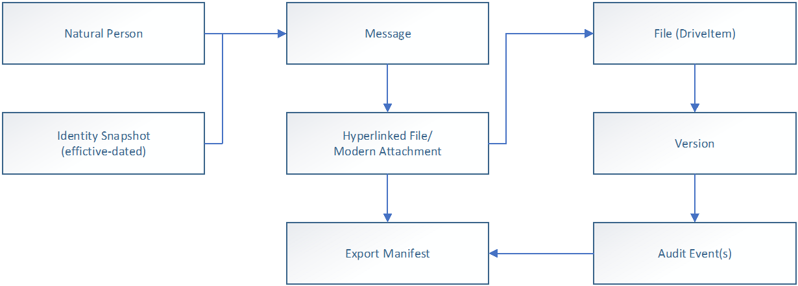

# What Is Reconstruction-Grade eDiscovery?

## Definition

**Reconstruction-Grade eDiscovery** is an architectural classification for evidence systems. It describes whether a system can produce a **reproducible, point-in-time record** of collaborative activity—without relying on hindsight or inference.

The term originates from the [Reconstruction-Grade eDiscovery Standard (RGR)](../front-matter.md), a vendor-neutral, testable specification for preserving and exporting evidence created in cloud collaboration platforms such as Microsoft 365.

A system is Reconstruction-Grade when it can deterministically answer:

- **What** document state existed at a specific moment in time.
- **Who** was involved, based on effective-dated identity—not a present-day directory snapshot.
- **What was shared**, through explicit message-to-file-to-version bindings preserved with stable identifiers.
- **Who accessed what, when**, grounded in audit evidence where available—not inferred from permissions.
- **What could not be collected**, captured as structured exception records rather than silent omissions.

Reconstruction-Grade eDiscovery replaces narrative-driven reconstruction with [evidence-driven reconstruction](evidence-reconstruction.md). If a claim cannot be grounded in preserved fact, it is represented as unknown—not assumed.

## The Context Gap

Modern enterprise work has moved to cloud-native collaboration. Communications reference live, shared documents through hyperlinks instead of embedded attachments. Files are continuously revised. Identity and access rights change over time. Audit logs age out.

This creates a **[Context Gap](context-gap-ediscovery.md)**: the distance between the artifact (a file or message) and the surrounding reality required to answer *what actually happened*.

Traditional eDiscovery architectures were built on assumptions that no longer hold:

| Assumption | Legacy model | Collaborative reality |
|---|---|---|
| Unit of evidence | File or attachment | Activity + link + shared repository object |
| Evidence capture | Final-state collection | Point-in-time resolution per event |
| Custodians | Static containers | Natural persons with effective-dated identity |
| Access | Inferred from permissions | Observed via audit evidence where available |
| Versioning | Minor or ignored | Continuous; version lineage is evidentiary |
| Messages | Immutable email | Threaded, editable, multi-modal conversations |

When evidence systems collect only today's file state, they produce a **time-shifted record**. The exported bytes are not the bytes that informed a decision at the time. Context collapse—the flattening of collaborative evidence into disconnected files and messages—makes reconstruction dependent on inference rather than preserved fact.

→ [Read the full definition: The Context Gap in eDiscovery](context-gap-ediscovery.md)

The Context Gap is formally analyzed in [Section 1: The Structural Shift](../01-structural-shift.md) and [Section 2: The Context Collapse Problem](../02-context-collapse.md) of the full standard.

## The Evidence Graph

Reconstruction-Grade systems preserve evidence as an interconnected graph of **objects, relationships, and timelines**—not a set of independent files.

The evidence graph is built on three pillars:

1. **Identity over time.**
   Authoritative, effective-dated identity correlated to a natural person—including role, department, manager, status, and group membership as of any historical date.

2. **Behavior and activity evidence.**
   Audit and activity records treated as first-class evidence to establish interaction (view, edit, share, access) and timing. Behavioral claims are explicitly bounded by upstream availability, licensing, and retention. Where audit evidence does not exist, the system represents observed access as *unknown*—it does not substitute permission-based inference.

3. **Document state and relationships.**
   Deterministic point-in-time file resolution using stable platform-native identifiers (siteId, driveId, itemId, versionId). Explicit message ↔ link ↔ file ↔ version bindings are preserved so that every communication can be reconnected to the document state it referenced.

These three pillars are formally defined in [Section 3: Defining Reconstruction-Grade eDiscovery](../03-defining-reconstruction-grade.md). Supporting concepts include:

- **As-sent version** — the file version that existed when a communication was sent, resolved as the latest version whose `lastModifiedDateTime ≤ message timestamp`.
- **Accessed version** — the file version a specific actor actually opened, derived from audit evidence. If audit evidence is unavailable, the accessed-version claim must be represented as unknown.
- **Deterministic exception record** — a structured record capturing every reference that could not be resolved, with reason codes, retry history, and parent-communication association.
- **Reproducible export** — an export where the same scope definition and parameters produce the same outputs, supported by manifests, hashes, and full exception traceability.

## Conformance Levels

The standard defines three conformance levels to support incremental adoption:

### RG-Core — Baseline Reconstruction-Grade

The minimum threshold. A system qualifies for RG-Core when it satisfies:

- Deterministic point-in-time document resolution
- Stable identifier preservation
- Relationship export integrity (message ↔ link ↔ file ↔ version)
- Deterministic exception handling (no silent drops)
- Reproducible export manifests with hashes and scope traceability

### RG-Plus — Identity and Behavior Conformance

Adds to RG-Core:

- Effective-dated identity reconstruction (historical role, department, manager, group membership)
- Audit-evidence ingestion and correlation with explicit boundedness reporting

### RG-Max — Expanded Reconstruction Depth

Adds to RG-Plus:

- Accessed-version analysis (where audit evidence supports it)
- Expanded artifact coverage (pages, lists, Loop components, and other collaboration objects)
- Advanced validation routines (referential integrity scoring, coverage gap alerting, multi-profile export)

Conformance levels are formally specified with full requirement mappings in [Appendix B: Reconstruction-Grade Requirements](../appendix-b-requirements.md). Minimum conformance tests (T-01 through T-07) are defined in [Section 6: Measurable Evaluation Framework](../06-evaluation-framework.md).

## Why It Matters

### Evidence is evaluated under adversarial conditions

Court challenges to authenticity, completeness, proportionality, and chain of custody assume that any ambiguous or non-reproducible claim will be contested. Reconstruction-Grade systems produce evidence records designed to withstand that scrutiny.

### Inference is not defensibility

When critical context is inferred after the fact—who had access, which version was relied upon, whether a document was actually seen—it becomes contestable, non-reproducible, and dependent on narrative. Reconstruction-Grade practice requires that context be preserved as evidence *while it exists*.

### Context decays over time

People leave organizations. Repositories are repurposed. Links break. Audit logs age out. Traditional eDiscovery begins after this loss has occurred. Reconstruction-Grade practice treats waiting as the fundamental mistake: if context will be needed later, it must be preserved now.

### The standard is testable

Reconstruction-Grade eDiscovery is not a marketing term. The [full standard](../front-matter.md) defines measurable requirements, minimum conformance tests, export and manifest expectations, and operational metrics. Claims of Reconstruction-Grade conformance can be independently verified.

## Related Concepts

- **[The Context Gap](context-gap-ediscovery.md)** — The structural problem that Reconstruction-Grade eDiscovery addresses.
- **[Evidence Reconstruction](evidence-reconstruction.md)** — The capability that defines whether a system is Reconstruction-Grade.
- **[Modern Attachments](modern-attachments.md)** — How hyperlinked files drive the need for deterministic version resolution.
- **[Identity Drift](identity-drift.md)** — Why effective-dated identity is a required evidence dimension.

## Further Reading

- [What Is the Context Gap in eDiscovery?](context-gap-ediscovery.md) — The structural problem
- [What Is Evidence Reconstruction?](evidence-reconstruction.md) — The defining capability
- [Modern Attachments](modern-attachments.md) — Hyperlinked file evidence
- [Identity Drift](identity-drift.md) — Temporal identity challenges
- [Core Concepts Index](index.md) — All concept definitions
- [Section 3: Defining Reconstruction-Grade eDiscovery](../03-defining-reconstruction-grade.md) — Formal specification
- [Appendix B: Requirements](../appendix-b-requirements.md) — Full requirement mappings
- [Section 6: Evaluation Framework](../06-evaluation-framework.md) — Conformance tests

---

<small>

**About this standard.** The Reconstruction-Grade eDiscovery Standard is an open, vendor-neutral specification maintained at [github.com/cloudficient/reconstruction-grade-ediscovery-standard](https://github.com/cloudficient/reconstruction-grade-ediscovery-standard) and licensed under [CC BY 4.0](https://creativecommons.org/licenses/by/4.0/). It is intended to support independent evaluation, procurement, and governance of collaborative evidence systems.

**Read the full standard:** [Reconstruction-Grade eDiscovery Standard →](../front-matter.md)

</small>
