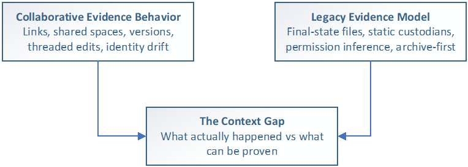

Draft status

- **Status:** Draft for standards discussion
- **Version:** 0.53-draft
- **Published:** April 2, 2026
- **Canonical source:** Markdown in the public Git repository
- **Origin and intent:** Draft originated by Cloudficient and published for vendor-independent standards discussion

# Reconstruction-Grade eDiscovery

The System of Record for Modern Collaborative Evidence

Draft for Standards Discussion - Version 0.53-draft - April 2, 2026

Author: Peter Kozak/Brandon D'Agostino

This document proposes an architectural standard. It is not legal advice.

## Executive Summary

Enterprise evidence has undergone a structural transformation. Collaborative cloud platforms have replaced static attachments, fixed identity states, and immutable communications with hyperlink-based content, continuous versioning, mutable conversations, and behavioral audit signals.

Traditional eDiscovery architectures were built on assumptions that no longer hold: that files are the unit of evidence, that custodians and ownership boundaries are stable, that permissions are a proxy for access, and that "the latest version" is an acceptable substitute for point-in-time truth.

In Microsoft 365 and similar environments, evidence is no longer self-contained. Communications reference live objects in shared repositories. Those objects continue to change. Identities and access rights evolve. Audit logs age out. The evidentiary substrate has shifted from document capture to [event reconstruction](concepts/evidence-reconstruction.md).

This document specifies Reconstruction-Grade eDiscovery as an architectural standard for modern collaborative evidence. A Reconstruction-Grade system preserves a reproducible, point-in-time evidentiary record that can answer legal and operational questions about what happened, when it happened, who was involved, what was relied upon, and what was accessed - without substituting inference for preserved fact.

The standard is methodological: inference is not defensibility. When critical context is inferred after the fact, it becomes contestable, non-reproducible, and dependent on narrative rather than preserved evidence. Reconstruction-Grade eDiscovery requires that context be preserved as evidence while it exists, including identity state, activity signals (where available), and deterministic bindings between communications and referenced object state.

This document is written to be testable. It defines (1) measurable requirements, (2) minimum conformance tests, (3) export and manifest expectations, and (4) operational metrics. It is intended to be vendor-neutral and to support independent evaluation.

**Figure 1 — [The Context Gap](concepts/context-gap-ediscovery.md)**

This standard identifies two structural failure modes in modern evidence preservation. The [Context Gap](concepts/context-gap-ediscovery.md) is a fidelity failure: evidence is preserved but does not reflect what was communicated, because collection captures the current document state rather than the version that existed at the time of the communication. The [Preservation Gap](concepts/preservation-gap.md) is a completeness failure: linked content resides in non-custodian storage outside the litigation hold scope and expires before anyone collects it — leaving a preserved email with a dead link and no recoverable evidence. Together, they define the diagnostic framework for evaluating whether a preservation workflow is adequate for collaborative, hyperlinked evidence.

## A Working Definition

This document distinguishes between a conformance target and an operating approach:

Reconstruction-Grade eDiscovery is the conformance target (the architectural classification). It describes whether a system can produce a reproducible, point-in-time record of collaborative evidence without relying on hindsight or inference.

Context-Aware eDiscovery is an operating approach consistent with that target. It treats context as evidence objects and grounds reconstruction in preserved fact - not semantic enrichment, relevance scoring, or post-hoc inference.

As used throughout this document, Context-Aware eDiscovery is reconstruction-grade evidence preservation across three required dimensions:

Identity over time - effective-dated custodian identity correlated to a natural person.

Behavior and activity evidence - audit records as first-class evidence, bounded by availability and retention.

Document state and relationships - deterministic point-in-time resolution with explicit message↔link↔file↔version bindings.

These pillars are formally defined in Section 3.1 and specified as normative requirements in Appendix B.

In this model, "context" refers to evidence objects, bindings, provenance, and reproducible reconstruction. It does not refer to AI-based interpretation, semantic scoring, or relevance ranking.

## What This Standard Changes

- Evidence is treated as an interconnected record (objects, relationships, and timelines), not a set of independent files.
- Document state is resolved deterministically as-of an event timestamp (e.g., message send time).
- Identity is effective-dated and tied to a natural person, not a directory snapshot.
- Access is grounded in audit evidence when available (who saw what, when), not inferred from permissions.
- Exports are reproducible: the same scope definition produces the same outputs, with manifests, hashes, and exception traceability.
